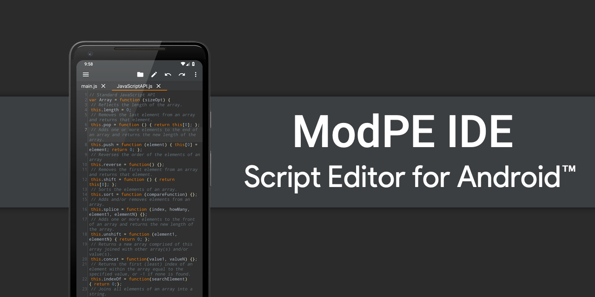

# ModPE IDE v2020.2.3

<b>ModPE IDE</b> is a professional code editor or IDE primarily for ModPE Script development.

 [](https://opensource.org/licenses/Apache-2.0)



## Download
<a href="https://play.google.com/store/apps/details?id=com.KillerBLS.modpeide">

</a>

----------

ModPE Script is a script language based on JavaScript and used to create mods for Minecraft PE. This app has nothing common with popular JavaScript editors and <b>you shouldn't use it for web programming</b>.

### STANDARD EDITION FEATURES
<b>•</b> Syntax Highlighting  
<b>•</b> Code Completion  
<b>•</b> Cross-session Editing  
<b>•</b> Unlimited Undo/Redo  
<b>•</b> Matching Delimiters  
<b>•</b> Auto Indentation  
<b>•</b> Select, Delete, and Duplicate Line  
<b>•</b> Find and Replace with navigation between results  
<b>•</b> Word Wrap  
<b>•</b> Pinch Zoom  
<b>•</b> Encoding support  
<b>•</b> Built-in File Explorer  
<b>•</b> Tablet UI  
<b>•</b> <i>No Ads!</i>  
<b>And much more!</b>

### ULTIMATE EDITION FEATURES
<b>•</b> Color Schemes  
<b>•</b> Theme Editor 🎉  
<b>•</b> External fonts  
<b>•</b> Increased tab limit  
<b>•</b> Error Checking  
<b>•</b> Color Picker

### LICENSE
```
Licensed to the Light Team Software (Light Team) under one or more
contributor license agreements.  See the NOTICE file distributed with
this work for additional information regarding copyright ownership.
The Light Team licenses this file to You under the Apache License, Version 2.0
(the "License"); you may not use this file except in compliance with
the License.  You may obtain a copy of the License at

     http://www.apache.org/licenses/LICENSE-2.0

Unless required by applicable law or agreed to in writing, software
distributed under the License is distributed on an "AS IS" BASIS,
WITHOUT WARRANTIES OR CONDITIONS OF ANY KIND, either express or implied.
See the License for the specific language governing permissions and
limitations under the License.
```
<b>• NOTE:</b> This software depends on other packages that may be licensed under different open source licenses.

### SCREENSHOTS


