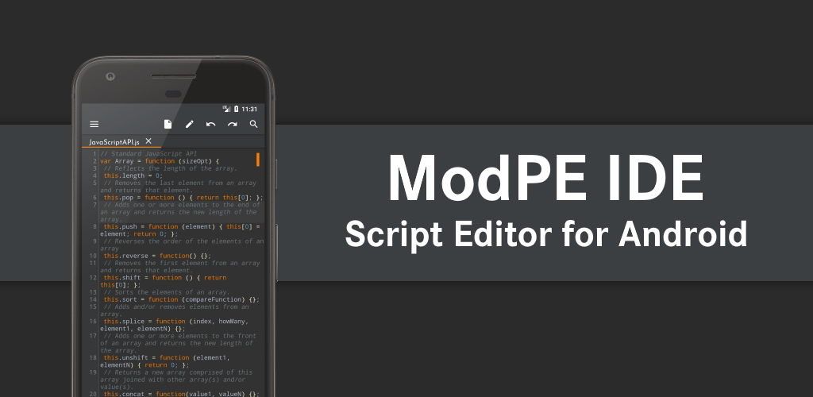
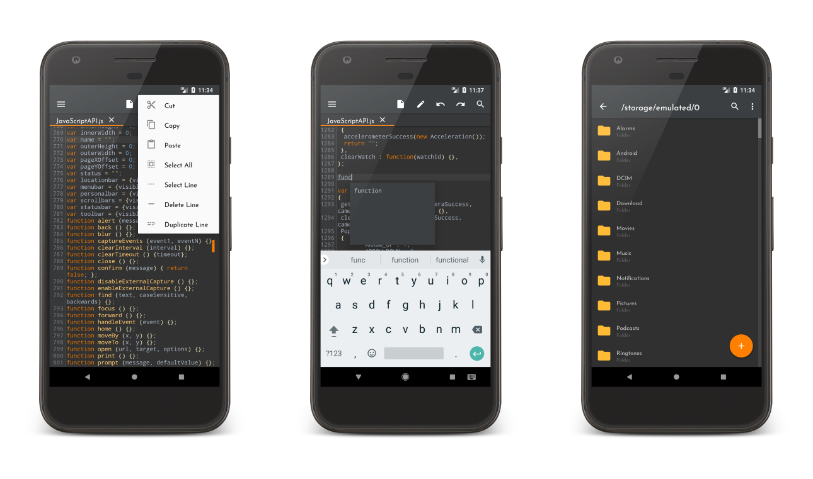

# ModPE IDE

----------

<b>ModPE IDE</b> - Simple and powerful ModPE code editor for Android Tablets and Phones.



<a href="https://play.google.com/store/apps/details?id=com.KillerBLS.modpeide">

</a>

----------

### KEY FEATURES
<b>•</b> Syntax Highlighting <i>(Like IntelliJ IDEA by JetBrains)</i>
<b>•</b> Code Completion (Beta)
<b>•</b> Material Theme with Material Icons
<b>•</b> Undo/Redo (Beta)
<b>•</b> Brackets Matching
<b>•</b> Auto-Indentation
<b>•</b> Pinch Zoom
<b>•</b> Line Numbers
<b>•</b> Go To Line
<b>•</b> Customizable font sizes
<b>•</b> Customizable font faces
<b>•</b> Keyboard Shortcuts (Hotkeys)
<b>•</b> Search & Replace (includes MatchCase)
<b>•</b> Fullscreen Mode
<b>•</b> Read Only Mode
<b>•</b> Built-in File Explorer
<b>•</b> Samsung Multiview Support
<b>•</b> Sony Dual Screen Support
<b>•</b> List of available functions, hooks, etc.
<b>•</b> <i>No Ads!</i>
<b>And much more!</b>

### PREMIUM ONLY FEATURES
<b>•</b> Error Checking
<b>•</b> Advanced Syntax Highlight settings
<b>•</b> Undo/Redo settings
<b>•</b> More fonts

### KEYBOARD SHORTCUTS
<b>•</b> <i>Ctrl-X</i> - Cut
<b>•</b> <i>Ctrl-C</i> - Copy
<b>•</b> <i>Ctrl-V</i> - Paste
<b>•</b> <i>Ctrl-Z</i> - Undo
<b>•</b> <i>Ctrl-Y</i> - Redo
<b>•</b> <i>Ctrl-A</i> - Select All
<b>•</b> <i>Ctrl+Shift-D</i> - Delete Line
<b>•</b> <i>Ctrl+Alt-A</i> - Select Line
<i>May not work properly! (Will be fixed)</i>

### UPCOMING FEATURES
<b>•</b> Cross-session Editing
<b>•</b> Extended Keyboard
<b>•</b> Customize Syntax Highlighting

### TRANSLATION
You can help to translate this application to your native language (if you want), please contact our email below, or make pull request on GitHub.

### CONTACT US
<b>•</b> <u>lightteamsoftware@gmail.com</u>

### OPEN SOURCE CODE
<b>•</b> <u>http://github.com/Light-Team/ModPE-IDE-Source</u>

### LICENSE
```
ModPE IDE is free software: you can redistribute it and/or modify
it under the terms of the GNU General Public License as published by
the Free Software Foundation, either version 3 of the License, or
(at your option) any later version.

ModPE IDE is distributed in the hope that it will be useful,
but WITHOUT ANY WARRANTY; without even the implied warranty of
MERCHANTABILITY or FITNESS FOR A PARTICULAR PURPOSE. See the
GNU General Public License for more details.
 
You should have received a copy of the GNU General Public License
along with this program.  If not, see
<http://www.gnu.org/licenses/>.
```
<b>• NOTE:</b> This software depends on other packages that may be licensed under different open source licenses.

### SCREENSHOTS



----------