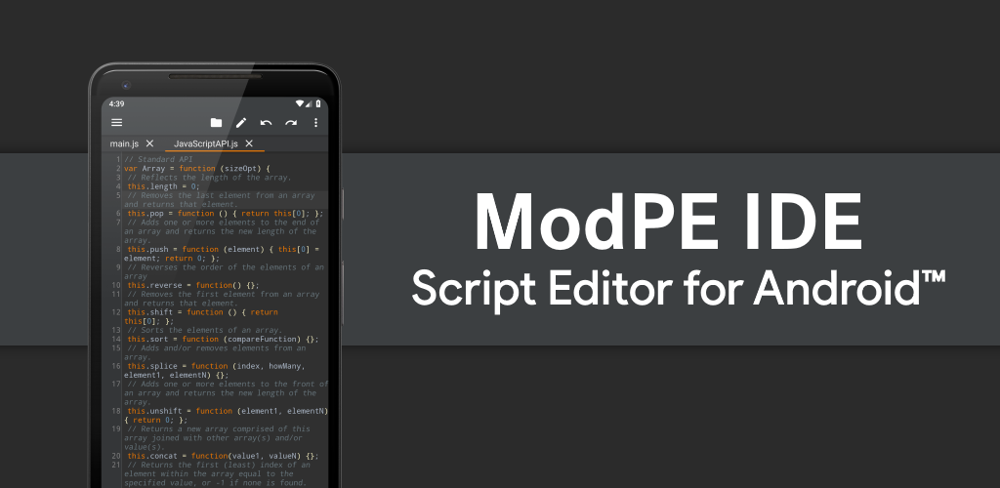
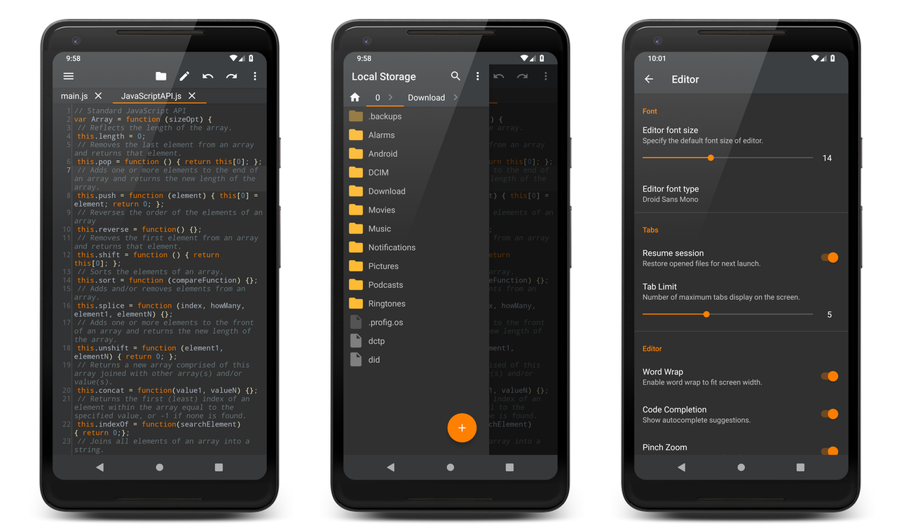

# ModPE IDE v2019.1.0

<b>ModPE IDE</b> is a professional IDE primarily for ModPE Script development.



<a href="https://play.google.com/store/apps/details?id=com.KillerBLS.modpeide">

</a>

----------

### STANDARD EDITION FEATURES
<b>•</b> Syntax Highlighting  
<b>•</b> Code Completion (Beta)  
<b>•</b> Cross-session Editing  
<b>•</b> Unlimited Undo/Redo  
<b>•</b> Matching Delimiters  
<b>•</b> Auto Indentation  
<b>•</b> Select, Delete, and Duplicate Line  
<b>•</b> Search, Replace, Go to Line  
<b>•</b> Word Wrap  
<b>•</b> Pinch Zoom  
<b>•</b> Powerful File Explorer  
<b>•</b> <i>No Ads!</i>  
<b>And much more!</b>  

### ULTIMATE EDITION FEATURES
<b>•</b> Unlock 6 new themes  
<b>•</b> Unlock 5 new fonts  
<b>•</b> Increased tab limit  
<b>•</b> Code Analysis  
<b>•</b> Color Picker

### CONTACT US
<b>•</b> <u>lightteamsoftware@gmail.com</u>

### LICENSE
```
Licensed to the Light Team Software (Light Team) under one or more
contributor license agreements.  See the NOTICE file distributed with
this work for additional information regarding copyright ownership.
The Light Team licenses this file to You under the Apache License, Version 2.0
(the "License"); you may not use this file except in compliance with
the License.  You may obtain a copy of the License at

     http://www.apache.org/licenses/LICENSE-2.0

Unless required by applicable law or agreed to in writing, software
distributed under the License is distributed on an "AS IS" BASIS,
WITHOUT WARRANTIES OR CONDITIONS OF ANY KIND, either express or implied.
See the License for the specific language governing permissions and
limitations under the License.
```
<b>• NOTE:</b> This software depends on other packages that may be licensed under different open source licenses.

### SCREENSHOTS


